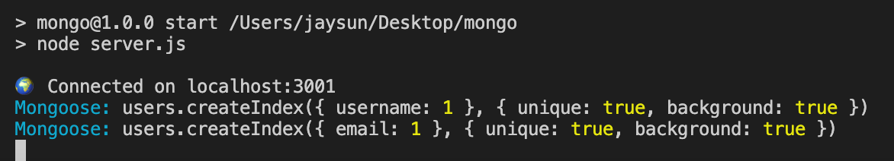
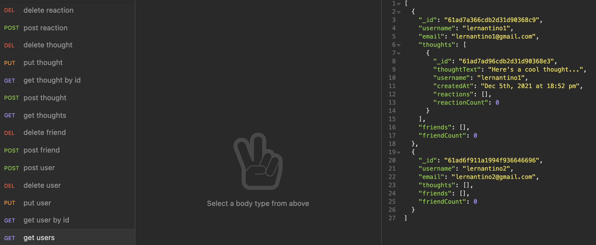

# Social Media API

[![Contributors][contributors-shield]][contributors-url]
[![Forks][forks-shield]][forks-url]
[![Stargazers][stars-shield]][stars-url]
[![Issues][issues-shield]][issues-url]
[![MIT License][license-shield]][license-url]

<!-- PROJECT LOGO -->
<br />
<p align="center">
  <a href="https://github.com/jsun994/social-api-mongo">
    
  </a>

  <p align="center">
  A social media api.
    <br />
    <a href="https://github.com/jsun994/social-api-mongo/"><strong>Explore the docs »</strong></a>
    <br />
    <br />
    <a href="https://drive.google.com/file/d/1Q6u0e5EQQYbGfp6WDD31jbSjMVs9g9uH/view">View Demo</a>
    ·
    <a href="https://github.com/jsun994/social-api-mongo/issues">Report Bug</a>
    ·
    <a href="https://github.com/jsun994/social-api-mongo/issues">Request Feature</a>
  </p>
</p>

<!-- TABLE OF CONTENTS -->
<details open="open">
  <summary><h2 style="display: inline-block">Table of Contents</h2></summary>
  <ol>
    <li>
      <a href="#about-the-project">About The Project</a>
      <ul>
        <li><a href="#built-with">Built With</a></li>
      </ul>
    </li>
    <li>
      <a href="#getting-started">Getting Started</a>
      <ul>
        <li><a href="#prerequisites">Prerequisites</a></li>
        <li><a href="#installation">Installation</a></li>
      </ul>
    </li>
    <li><a href="#usage">Usage</a></li>
    <li><a href="#contributing">Contributing</a></li>
    <li><a href="#contact">Contact</a></li>
  </ol>
</details>

<!-- ABOUT THE PROJECT -->
## About The Project


Demo Video - [Screencastify - Google Drive](https://drive.google.com/file/d/1Q6u0e5EQQYbGfp6WDD31jbSjMVs9g9uH/view)

### Built With

* node.js
* express.js
* mongoose

<!-- GETTING STARTED -->
## Getting Started

To get a local copy up and running follow these simple steps.

### Prerequisites

This is an example of how to list things you need to use the software and how to install them.
* npm
  ```sh
  npm install npm@latest -g
  ```

### Installation

1. Clone the repo
   ```sh
   git clone git@github.com:jsun994/social-api-mongo.git
   ```
2. Install NPM packages
   ```sh
   npm install
   ```

<!-- USAGE EXAMPLES -->
## Usage

    GIVEN a social network API
    WHEN I enter the command to invoke the application
    THEN my server is started and the Mongoose models are synced to the MongoDB database
    WHEN I open API GET routes in Insomnia for users and thoughts
    THEN the data for each of these routes is displayed in a formatted JSON
    WHEN I test API POST, PUT, and DELETE routes in Insomnia
    THEN I am able to successfully create, update, and delete users and thoughts in my database
    WHEN I test API POST and DELETE routes in Insomnia
    THEN I am able to successfully create and delete reactions to thoughts and add and remove friends to a user’s friend list



<!-- CONTRIBUTING -->
## Contributing

1. Fork the Project
2. Create your Feature Branch (`git checkout -b feature/AmazingFeature`)
3. Commit your Changes (`git commit -m 'Add some AmazingFeature'`)
4. Push to the Branch (`git push origin feature/AmazingFeature`)
5. Open a Pull Request

<!-- CONTACT -->
## Contact

Jay Sun - [email me](mailto:jaysun054@gmail.com)

[contributors-shield]: https://img.shields.io/github/contributors/jsun994/social-api-mongo.svg?style=for-the-badge
[contributors-url]: https://github.com/jsun994/social-api-mongo/graphs/contributors
[forks-shield]: https://img.shields.io/github/forks/jsun994/social-api-mongo.svg?style=for-the-badge
[forks-url]: https://github.com/jsun994/social-api-mongo/network/members
[stars-shield]: https://img.shields.io/github/stars/jsun994/social-api-mongo.svg?style=for-the-badge
[stars-url]: https://github.com/jsun994/social-api-mongo/stargazers
[issues-shield]: https://img.shields.io/github/issues/jsun994/social-api-mongo.svg?style=for-the-badge
[issues-url]: https://github.com/jsun994/social-api-mongo/issues
[license-shield]: https://img.shields.io/github/license/jsun994/social-api-mongo.svg?style=for-the-badge
[license-url]: https://github.com/jsun994/social-api-mongo/blob/master/LICENSE.txt